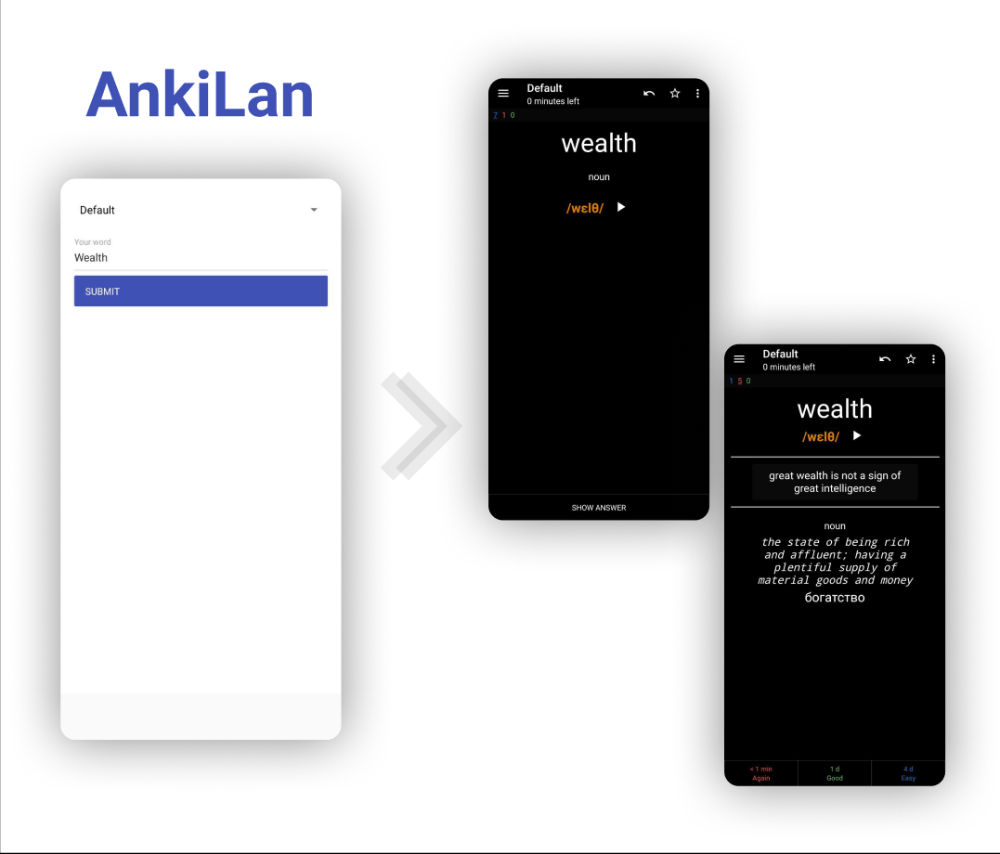

# AnkiLan
App provide creating automatically fill fields with English words and their definitions, examples, translates and add it to Anki.
App required already installed [Anki](https://apps.ankiweb.net/) on your phone.  

- - -
 
 
## Build and start
```bash
git clone https://github.com/Horhik/ankilan
yarn install

yarn start
	# launch paralell
react-native run-android

```
if something not working read [react native docs](https://reactnative.dev/docs/getting-started)

## Debug
##### For linux:
Read [this](https://gist.github.com/Horhik/28c40259a79fabdd358822cede105c09#file-rn-redux-devtools-md)
Instead yarn start and react-native run-android, you may launch `./rn-start.sh` and `./tools-start.sh`
##### Other
It's up to you 😜

## Goals
- [x] ~~Basic functional~~
- [ ] Add Urban dictionary support
- [ ] Support for other languages than Russian
- [ ] Add fields editor
- [ ] Add dark theme
- [ ] Create flexibility models
- [ ] Download sound of word to filesystem
